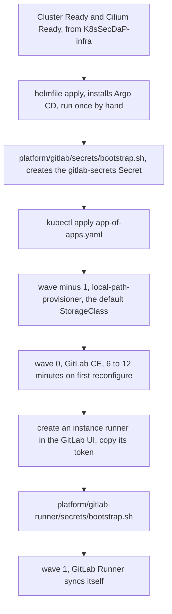

# K8sSecDaP-deploy

Everything that runs *on* the cluster that
[K8sSecDaP-infra](https://github.com/john-naeder/K8sSecDaP-infra) builds, managed by Argo CD.
Two or three bare-metal nodes, roughly 7 GB of RAM each, reachable only over a tailnet.

The whole repo is shaped by that memory budget and by the absence of an ingress controller.
Most of what a platform stack usually contains was removed in August 2026 rather than tuned,
because on this hardware each component was costing more than it returned. What is left is:
Argo CD, a self-hosted GitLab CE, a storage provisioner, and backup.

## Bootstrap order



Exactly one thing is installed imperatively: Argo CD, by Helmfile. From `app-of-apps.yaml`
onward every change goes through Git.

The two manual pauses are not accidents. GitLab's admin password has to exist before the pod
starts, and the runner's registration token does not exist until GitLab is running and a human
has clicked through the UI. Encoding either into Git would mean putting a credential in Git.

## Layout

```
platform/helmfile/              the single bootstrap release, Argo CD 7.8.7
platform/argocd/app-of-apps.yaml    the root Application, points at apps/
platform/argocd/apps/           one Application per component, ordered by sync-wave
platform/argocd/appsets/        an ApplicationSet that generates a root per registered cluster
platform/argocd/clusters/       one config.yaml per cluster, read by that ApplicationSet
platform/gitlab/                GitLab CE StatefulSet, ClusterIP and NodePort Services
platform/gitlab-runner/         the bootstrap script for the runner's token
platform/backup/                Velero values and the MinIO deployment it writes to
```

Sync waves: `-1` storage, `0` GitLab, `1` GitLab Runner. Storage must exist before anything
asks for a PVC; the runner needs both a running GitLab and a token from it.

## Decisions, and what they cost

**GitLab Omnibus in one pod, not the cloud-native chart.** The official chart, already stripped
of registry, MinIO, Prometheus, Grafana, Pages and cert-manager and down to one webservice
replica, still wants about 6.3 GB — and wants it on a single node. The worker has 7 GB total
and roughly 5.7 GB after kubelet and the Cilium agent. The remainder would spill onto the
master, which means scheduling Gitaly or Puma next to etcd. Omnibus packs the lot into one
container at a 2.5 GB request and a 5 GB limit. The price is no HA, monolithic upgrades, no
per-component scaling, and one restart takes all of GitLab down. `platform/gitlab/README.md`
lists which Omnibus components are disabled and why.

**No ingress controller, therefore no cert-manager.** The cluster is only reachable inside the
tailnet, so services are exposed by NodePort. Thanks to Cilium's `kubeProxyReplacement` a
NodePort answers on *every* node, including nodes not running the pod, so the address stays
correct when GitLab moves. Traefik and cert-manager mostly existed to serve each other; both
were removed together.

**No sealed-secrets.** Each component that needs a Secret ships `secrets/bootstrap.sh` and a
`*.env.example`; the real values live in a gitignored `*.env` and are applied out of band. The
scripts are idempotent. The property worth having is the failure mode: a missing Secret leaves
the pod at `CreateContainerConfigError`, rather than falling back to some default that quietly
works. Note the `.gitignore` ignores `*.env` and not the `secrets/` directory — ignoring the
directory would also hide the bootstrap scripts and the examples, which are the documentation
of which secrets have to exist.

**local-path storage, and the trap in it.** There is no CSI driver on this hardware, so
`local-path-provisioner` is the default StorageClass with `reclaimPolicy: Retain`. A PVC is a
directory on one specific node's disk and the PV carries a `nodeAffinity` pointing at it. The
consequence is easy to get wrong: **the pod is pinned by its data, not by any `nodeSelector`.**
Cordoning the node and deleting the pod does not move GitLab — it leaves the pod `Pending`,
because the PVC cannot follow. Moving it for real means `rsync`-ing the directory and editing
the PV's affinity. The procedure is written out in `platform/gitlab/README.md`.

**Velero with file-system backup, not volume snapshots.** local-path has no CSI snapshotter,
so snapshot-based backup would capture Kubernetes objects and none of the data inside the PVs
— a GitLab backup containing no repositories. `defaultVolumesToFsBackup: true` with the kopia
uploader copies the actual contents instead. The destination is a MinIO instance pinned by
`nodeSelector` and `hostPath` to a 1 TB drive on the master, deliberately not a PVC, so the
backup does not land on the same disk as the thing it is backing up. **This is not off-site
backup.** If that machine is lost, the cluster and its backups go together.

**The runner is not privileged.** The pipelines in
[ci-templates](https://github.com/john-naeder/ci-templates) run Trivy, Gitleaks and Semgrep,
all ordinary processes with no need for Docker-in-Docker. Enabling `privileged` for safety's
sake is the fastest way to turn every CI job into root on the node.

**The runner talks to GitLab through its NodePort**, not the internal Service. Going through
the Service gives a `Host` header that disagrees with `external_url`, and GitLab then hands
back artifact and trace URLs pointing somewhere unreachable. One extra hop buys one URL that
is correct everywhere.

## Multi-cluster

`appsets/cluster-roots.yaml` is an ApplicationSet with a Git file generator over
`platform/argocd/clusters/*/config.yaml`. It generates one root Application per cluster
config present in the repo, and is the fleet-shaped replacement for `app-of-apps.yaml` once
more than one cluster is registered. Adding a cluster is `argocd cluster add`, a config file,
and a commit. Only `clusters/onprem/` is live; `clusters/gke/config.yaml.example` is a
placeholder that has never been applied.

## Limits

- **Velero and MinIO have manifests but no Argo CD Application.** `platform/backup/` is applied
  by hand; nothing in `apps/` reconciles it. Either it should be a wave-2 app or the README
  should stop implying GitOps manages it.
- **The SOC stack is not deployed from here.** The August cutback removed the `zt-soc-core`
  and `zt-soc-data` Applications along with Tekton, Traefik, cert-manager, sealed-secrets, the
  Cloudflare tunnel, Kyverno, Prometheus, Grafana, Loki, uptime-kuma and metrics-server. The
  manifests in `K8sSecDaP-soc/manifests/` are currently applied manually.
- **No monitoring at all.** Nothing scrapes metrics and nothing collects logs. Several
  components still expose Prometheus endpoints with no consumer.
- **`app-of-apps.yaml` and `apps/gitlab.yaml` point at this repo over SSH**, so Argo CD needs
  a registered deploy key (`argocd repo add ... --ssh-private-key-path <key>`) before the first
  sync will resolve. The ApplicationSet points at a different remote than the two root
  Applications do — they have drifted and should be reconciled.
- **PVC sizes cannot be changed after binding.** local-path does not support resize, and the
  GitLab StatefulSet asks for 36 Gi across three claims. Check free space before the first sync.
- **Single replica of everything.** Argo CD, GitLab, MinIO and the provisioner all run one pod.
